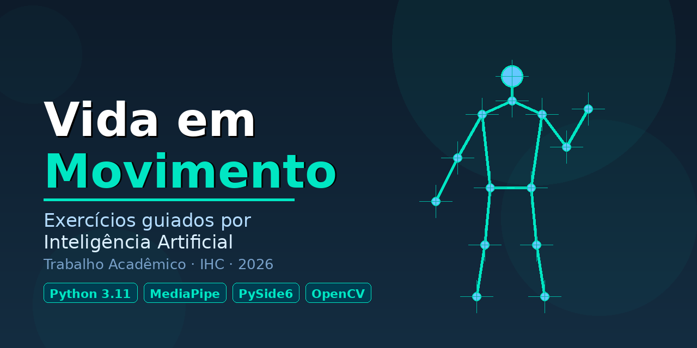

<p align="center">
  
</p>
<p align="center">


</p>

---

# 📖 Sobre o Projeto

O **Vida em Movimento** é uma aplicação desktop desenvolvida para auxiliar **idosos** na execução de exercícios de alongamento guiados por Inteligência Artificial.

Utilizando apenas a câmera do computador, o sistema identifica automaticamente a postura do usuário, acompanha os movimentos em tempo real e fornece feedback visual durante toda a execução do exercício.

O projeto foi desenvolvido como trabalho da disciplina de **Interação Humano-Computador (IHC)**, com foco em acessibilidade, usabilidade e qualidade da experiência do usuário.

---

# 🎯 Objetivos

O sistema busca:

- Promover a consciência corporal;
- Auxiliar na execução correta dos exercícios;
- Fornecer feedback em tempo real;
- Incentivar a prática segura de alongamentos;
- Disponibilizar uma interface simples e acessível para idosos.

---

# ✨ Funcionalidades

- 📷 Detecção corporal em tempo real utilizando MediaPipe;
- 🤖 Correção automática da postura;
- 💬 Feedback visual durante a execução;
- 🎥 Vídeo demonstrativo sincronizado;
- 📈 Três níveis de dificuldade;
- 🔢 Contagem automática de repetições;
- 🖥 Interface intuitiva desenvolvida para o público idoso.

---

# 🧘 Exercícios Disponíveis

| Exercício | Objetivo |
|------------|----------|
| Elevação Frontal Unilateral | Mobilidade dos ombros |
| Elevação Lateral Bilateral | Fortalecimento dos membros superiores |
| Inclinação Lateral | Alongamento do tronco |

---

# 🚀 Instalação

## Usuário Final

Não é necessário instalar Python.

Acesse a página de **Releases**:

👉 https://github.com/GeovanaBlasius/Vida-em-movimento---IHC/releases/latest

1. Baixe o instalador;
2. Execute o arquivo;
3. Siga as etapas da instalação;
4. Abra o aplicativo.

> O Windows poderá exibir um aviso de segurança. Clique em **Mais informações → Executar assim mesmo**.

---

# 💻 Executando pelo Código-Fonte

## Pré-requisitos

- Python 3.11 ou superior
- Webcam

Clone o projeto:

```bash
git clone https://github.com/GeovanaBlasius/Vida-em-movimento---IHC.git
cd Vida-em-movimento---IHC
```

Instale as dependências:

```bash
pip install -r requirements.txt
```

Execute:

```bash
python main.py
```

---

# 🏗 Estrutura do Projeto

```text
Vida-em-movimento
│
├── assets/
│
├── build/
│
├── docs/
│   ├── images/
│   └── gifs/
│
├── instaladores/
│
├── src/
│   ├── config.py
│   │
│   ├── core/
│   │   ├── analisador.py
│   │   ├── controle/
│   │   └── exercicios/
│   │
│   └── interface/
│       ├── telas/
│       ├── widgets/
│       ├── app.py
│       └── tema.py
│
├── main.py
│
├── requirements.txt
│
└── pose_landmarker_full.task
```

---

# ⚙️ Tecnologias

| Tecnologia | Finalidade |
|------------|------------|
| Python 3.11 | Linguagem principal |
| PySide6 | Interface gráfica |
| MediaPipe | Detecção corporal |
| OpenCV | Processamento de vídeo |
| NumPy | Cálculos geométricos |

---

# 🔄 Fluxo da Aplicação

```text
Tela Inicial
      │
      ▼
Escolha da Dificuldade
      │
      ▼
Execução do Exercício
      │
      ├── Vídeo Demonstrativo
      ├── Captura da Webcam
      ├── Detecção da Postura
      ├── Correção em Tempo Real
      └── Contagem das Repetições
      │
      ▼
Tela de Resultado
```

---

# 👥 Equipe

### Geovana Blasius
- GitHub: https://github.com/GeovanaBlasius
- E-mail: blasiusgeovana61@gmail.com

---

### Davi Bianchi Ayres
- GitHub: https://github.com/Davibianchi01
- E-mail: dbianchiayres@gmail.com

---

### Miguel Antonio Campos de Oliveira
- GitHub: https://github.com/MiqueasGames
- E-mail: omiguelantonio190@gmail.com

---

# 📄 Licença

Este projeto está licenciado sob a [Licença MIT](LICENCE.md).

Consulte também o arquivo [NOTICES.md](NOTICES.md) para informações sobre as bibliotecas de terceiros utilizadas.

---

<div align="center">

Desenvolvido para a disciplina de **Interação Humano-Computador (IHC)**

**INSTITUTO FEDERAL CATARINENSE - CAMPUS RIO DO SUL**

</div>
